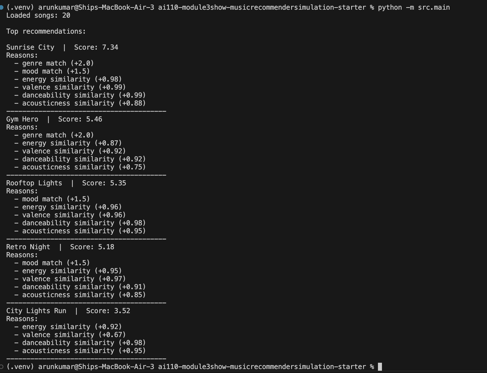
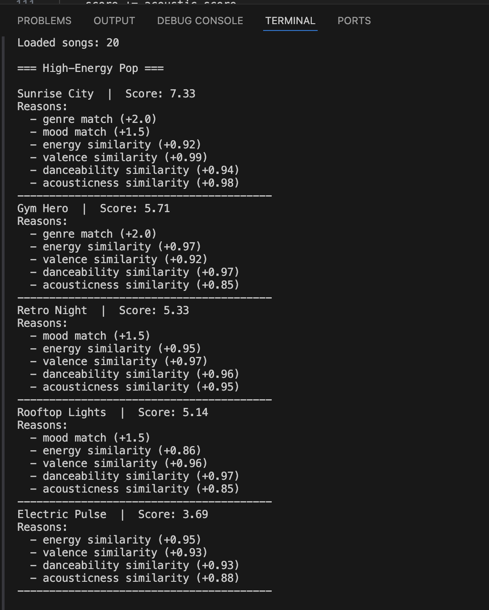
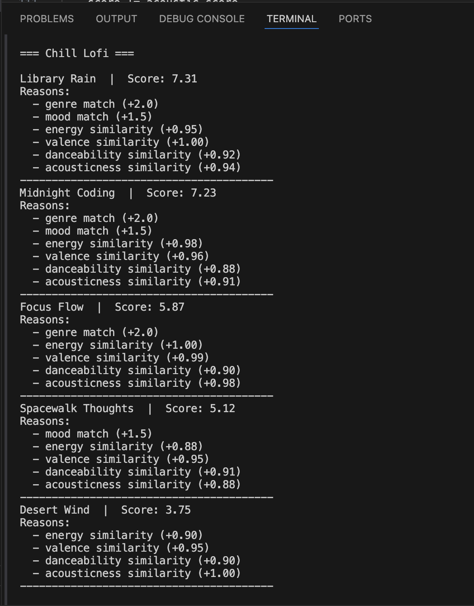
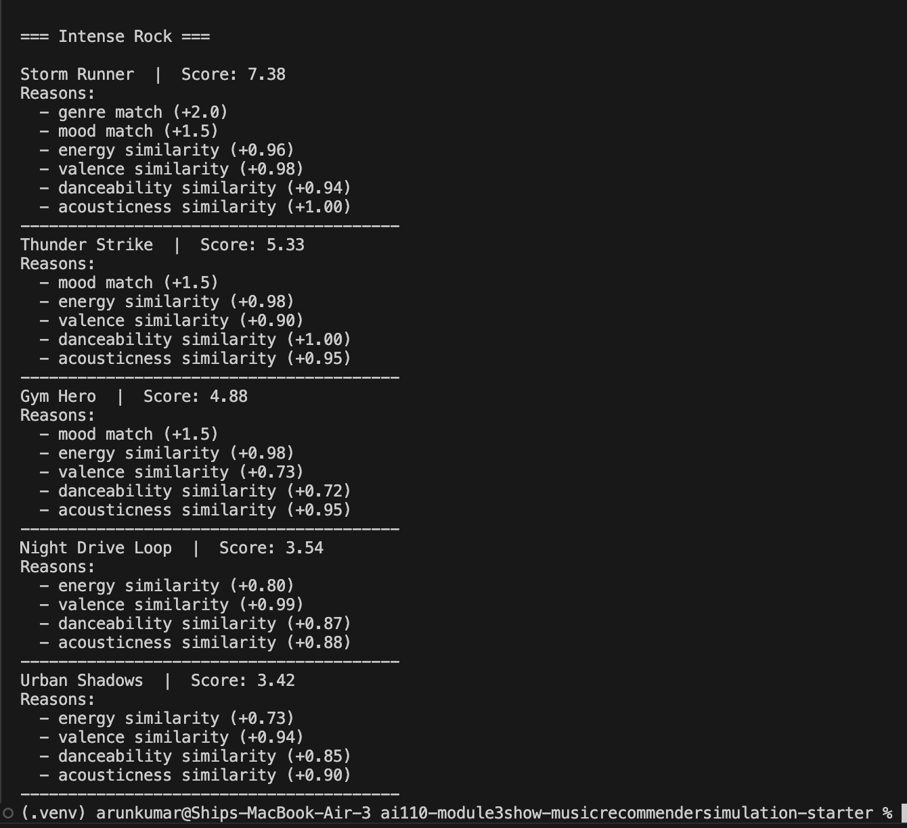

# 🎵 Music Recommender Simulation

## Project Summary

In this project you will build and explain a small music recommender system.

Your goal is to:

- Represent songs and a user "taste profile" as data
- Design a scoring rule that turns that data into recommendations
- Evaluate what your system gets right and wrong
- Reflect on how this mirrors real world AI recommenders

Replace this paragraph with your own summary of what your version does.

---

## How The System Works
This recommender system simulates how platforms like Spotify recommend songs using a content-based approach. It compares a user’s preferences with song features and suggests the closest matches.

Each `Song` uses features like **genre, mood, energy, valence, danceability, acousticness, and tempo_bpm** to represent its overall vibe.

The `UserProfile` stores preferences such as **favorite genre, mood, and target values for energy and valence**.

The `Recommender` gives each song a score by:

* rewarding **genre and mood matches**
* adding points based on how close numerical features (like energy) are to user preferences

Finally, all songs are **ranked by score**, and the top **K songs** are recommended to the user.

---
### Algorithm Recipe
+2.0 points for genre match
+1.5 points for mood match
Similarity-based scoring for numerical features:
Energy → 1 - |song_energy - user_energy|
Valence → 1 - |song_valence - user_valence|
Danceability → 1 - |song_danceability - user_danceability|
Acousticness → 1 - |song_acousticness - user_acousticness|

Songs are scored based on these rules and then ranked from highest to lowest score. The top K songs are recommended.

---
### System Flow


flowchart TD
    A[User Preferences] --> B[Load Songs from CSV]
    B --> C[Loop through each Song]
    C --> D[Apply Scoring Logic]
    D --> E[Assign Score + Reasons]
    E --> F[Store Results]
    F --> G[Sort by Score]
    G --> H[Select Top K Songs]
    H --> I[Return Recommendations]


---

## 🧠 What this shows (simple understanding)

- Input → user preferences  
- Process → compare with each song + score  
- Output → ranked top recommendations  

---

## ⚠️ Quick check (important)

Make sure your diagram reflects:
- Loop over **each song** ✔  
- Scoring step ✔  
- Sorting step ✔  
- Top K selection ✔  


Potential Biases
The system may over-prioritize genre, causing it to ignore songs that match the user’s mood but belong to a different genre.
Songs with similar energy and valence may rank high even if they don’t fully match the user’s taste.
The dataset is small, so recommendations may lack diversity and repeat similar types of songs.
The system does not consider factors like lyrics or context, so it may miss deeper emotional meaning.

---

## Getting Started

### Setup

1. Create a virtual environment (optional but recommended):

   ```bash
   python -m venv .venv
   source .venv/bin/activate      # Mac or Linux
   .venv\Scripts\activate         # Windows

2. Install dependencies

```bash
pip install -r requirements.txt
```

3. Run the app:

```bash
python -m src.main
```

### Running Tests

Run the starter tests with:

```bash
pytest
```

You can add more tests in `tests/test_recommender.py`.

---


## Sample CLI Output



### High-Energy Pop


### Chill Lofi


### Intense Rock


Accuracy and Observations

The recommendations mostly feel accurate based on my expectations. For the "High-Energy Pop" profile, songs like Sunrise City ranked at the top because they matched both genre and mood and had high similarity in energy and valence. Similarly, for the "Chill Lofi" profile, lower-energy and more acoustic songs appeared higher, which aligns with how I perceive relaxed music.

One interesting observation is that some songs ranked high even without a genre match because their numerical features (energy, valence, etc.) were very close to the user’s preferences. This shows that the system balances categorical and numerical features effectively.

However, I noticed that songs with strong genre matches tend to dominate the top results. This suggests that the genre weight might be slightly too high, which could reduce diversity in recommendations.


## Experiments You Tried

I performed a weight shift experiment by reducing the importance of genre and increasing the importance of energy similarity. After this change, songs with energy levels closer to the user’s preference ranked higher, even if they did not match the genre.

This made the recommendations more diverse but sometimes less aligned with the user’s core taste. This shows that the system is sensitive to how feature weights are assigned.

---

## Limitations and Risks

Summarize some limitations of your recommender.

Examples:

- It only works on a tiny catalog
- It does not understand lyrics or language
- It might over favor one genre or mood

You will go deeper on this in your model card.

---

## Reflection


This project helped me understand how recommender systems turn user preferences into predictions using simple scoring logic. I learned that even basic features like genre and energy can produce meaningful recommendations.

I also realized how bias can be introduced through feature weighting. Small changes in weights significantly affected the results, which shows how important it is to design balanced systems.


---
